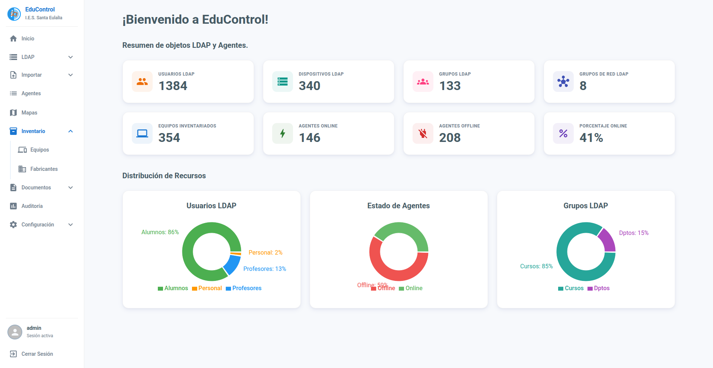

# EduControl

EduControl es una plataforma integral diseñada para la gestión, monitorización y control de equipamiento tecnológico, orientada a entornos educativos. Permite administrar de forma centralizada los dispositivos, visualizar su ubicación a través de mapas, gestionar usuarios y obtener métricas de uso.

## Tecnologías Utilizadas

- **Frontend:** React, TypeScript, Vite, React Context API / useReducer, Material UI.
- **Backend:** Python, Django, Django Rest Framework.
- **Comunicación:** WebSockets, xterm, VNC.
- **Base de Datos:** PostgreSQL, Redis.
- **Generación de Documentos:** ReportLab, OpenPyXL.
- **Infraestructura:** Docker, Docker Compose, Nginx.
- **Despliegue/Configuración:** Puppet.

## Módulos Principales del Proyecto

El sistema se estructura en varios módulos fundamentales. A continuación se incluye una breve explicación de cada uno, junto con los enlaces a su correspondiente documentación:

- **[Agentes](./docs/AGENTS.md)**: Encargados de la recolección de datos y la monitorización constante de los equipos cliente en tiempo real.
- **[Inventario](./docs/INVENTORY.md)**: Gestión del hardware, características y software de todos los dispositivos registrados en la red.
- **[LDAP](./docs/LDAP.md)**: Módulo de integración con el servidor LDAP para la gestión de usuarios y dispositivos.
- **[Mapas](./docs/MAPS.md)**: Interfaz para la representación visual y localización física de los equipos sobre los planos del centro educativo.
- **[Servidor](./docs/SERVER.md)**: Control y mantenimiento del servidor principal del centro educativo mediante diversas operaciones automatizadas.
- **[Documentos](./docs/REPORTS.md)**: Herramienta para la generación de documentos.

## Instalación del Servidor EduControl

Para conocer todos los detalles sobre cómo instalar, configurar y actualizar el servidor EduControl, consulta la [Instalación del Servidor](./docs/INSTALLATION.md).

---

## Instalación del Agente EduControl

Para instalar el agente EduControl en los clientes mediante Puppet, consulta la documentación en [Instalación del Agente](agent/README.md).

---

## Descargo de Responsabilidad

EduControl es un proyecto desarrollado con fines educativos e internos. Se distribuye **tal cual**, sin garantías de ningún tipo, expresas o implícitas.

El autor no se hace responsable de:

- Pérdidas de datos, daños en sistemas o cualquier perjuicio derivado del uso, correcto o incorrecto, de este software.
- Problemas de seguridad que puedan surgir de una configuración inadecuada del entorno de despliegue.
- La disponibilidad, continuidad o actualización del proyecto.

El uso de EduControl en entornos de producción queda bajo la **exclusiva responsabilidad del administrador** que lo despliega. Se recomienda revisar la configuración, los certificados SSL y las credenciales antes de exponer el servicio en redes públicas.
