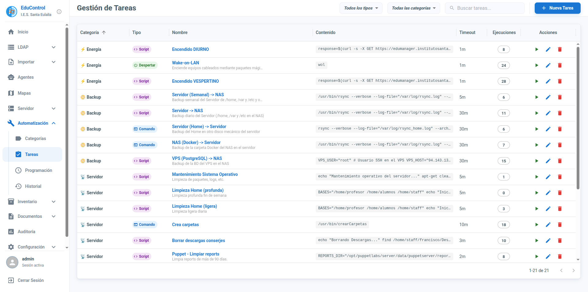
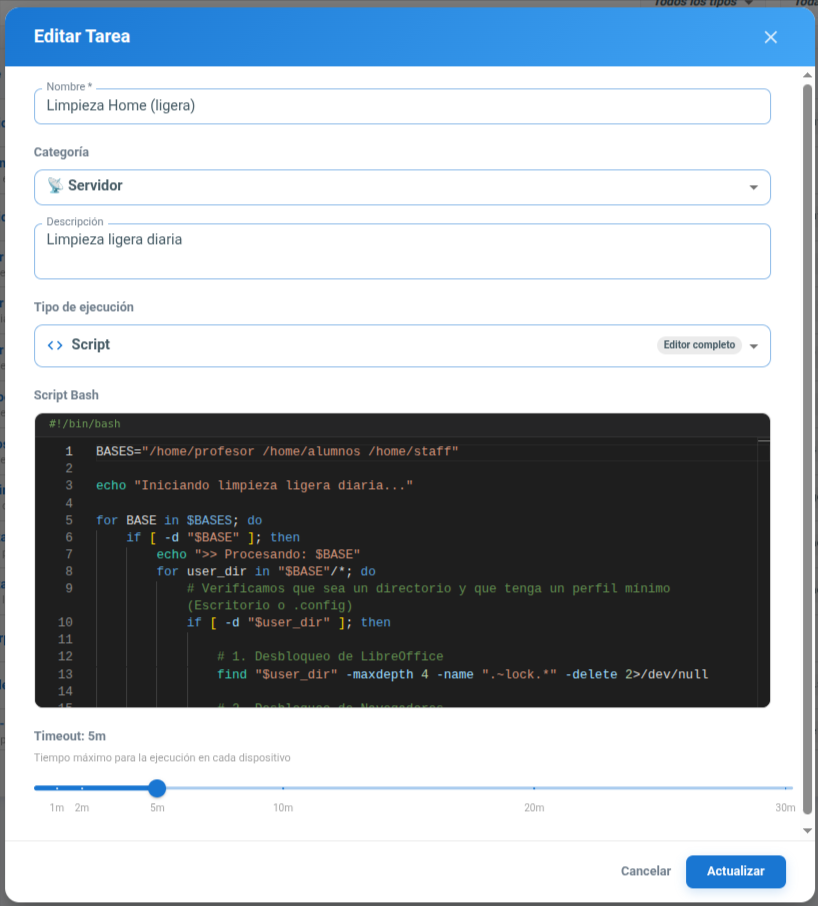
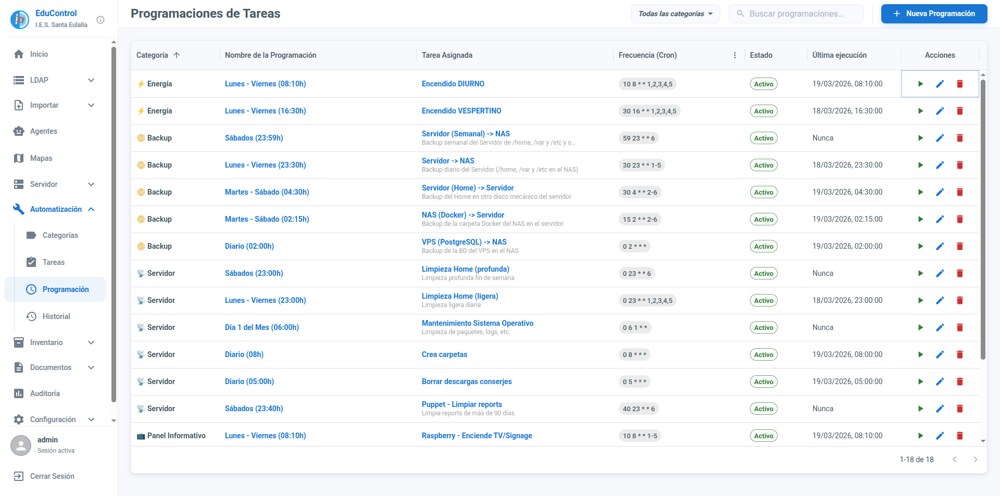
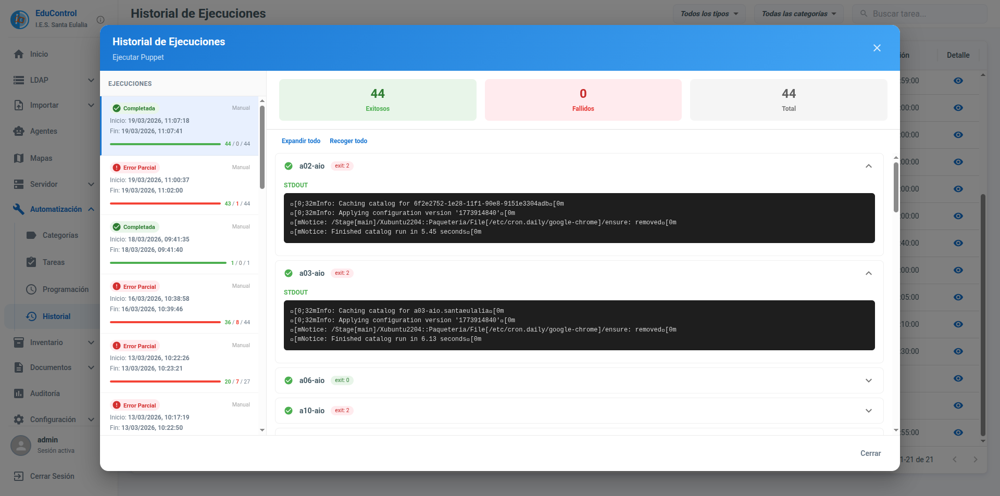

# Módulo de Automatizaciones

El módulo de Automatizaciones de EduControl permite ejecutar acciones remotas de forma controlada sobre uno o varios equipos, ya sea bajo demanda o mediante planificación.

Su objetivo es reducir tareas repetitivas de administración y dar trazabilidad completa sobre cada ejecución.

## Funcionalidades Principales

### 1. Tareas
En este módulo se pueden crear tareas reutilizables que después podrán lanzarse sobre los equipos que se deseen.

Los tipos de tarea disponibles son:

- **Encender equipo:** Acción orientada al arranque remoto de dispositivos compatibles.
- **Comando:** Ejecución de comandos del sistema en los agentes seleccionados.
- **Script:** Ejecución de scripts definidos por el administrador para operaciones más complejas.

Cada tarea puede configurarse con su nombre y contenido, de forma que quede disponible para usarla tantas veces como sea necesario.

Una vez creada, la tarea se puede ejecutar de forma manual seleccionando uno o varios equipos de destino. Esto permite, por ejemplo, aplicar una acción puntual a un aula completa o a un subconjunto concreto de dispositivos.

### 2. Programación
Además de la ejecución manual, las tareas pueden programarse para que se ejecuten automáticamente en una fecha y hora definidas.

La programación está pensada para trabajos recurrentes o de mantenimiento, por ejemplo:

- Encendidos previos al inicio de la jornada.
- Comandos de mantenimiento fuera del horario lectivo.
- Scripts periódicos de comprobación.
- Copias de seguridad

Con esta funcionalidad se puede:

- Definir cuándo debe ejecutarse una tarea.
- Elegir sobre qué equipos o grupos se aplicará.
- Mantener una operativa predecible sin intervención manual constante.

Gracias a la planificación, el administrador puede preparar acciones con antelación y asegurar su ejecución en ventanas de tiempo adecuadas.

### 3. Historial
El módulo incluye un historial de ejecuciones para consultar lo que ha ocurrido con cada tarea lanzada, tanto manual como programada.

Desde el historial se puede visualizar:

- La tarea ejecutada.
- El momento de ejecución.
- Los equipos de destino.
- El estado de cada ejecución.

Esta vista facilita el seguimiento operativo, la auditoría y la detección de incidencias, ya que permite comprobar rápidamente qué acciones se han realizado y su resultado.

[Volver](../README.md)
