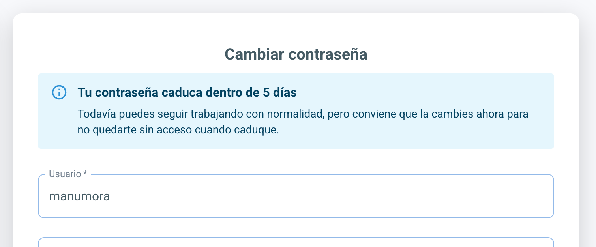
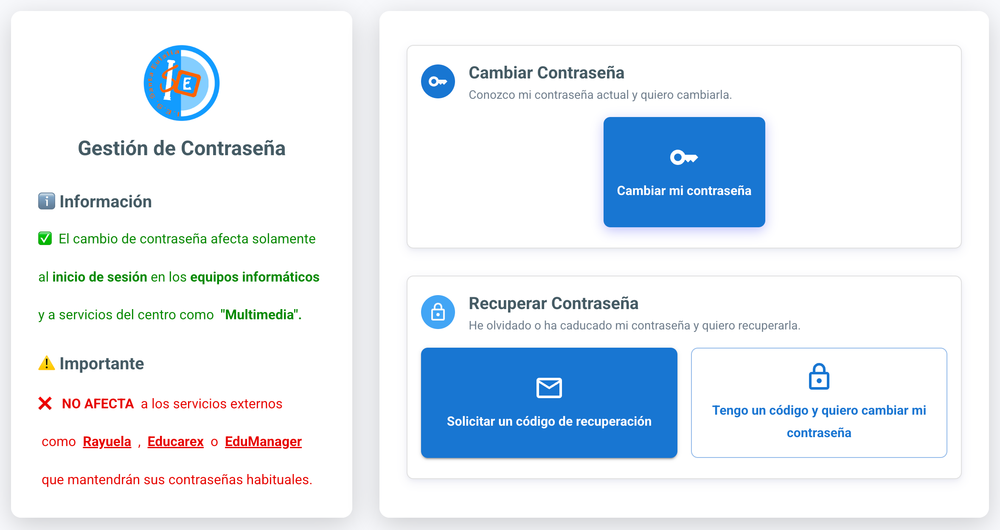
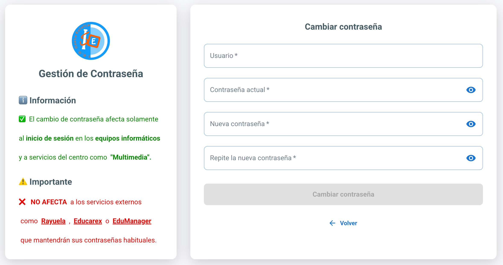
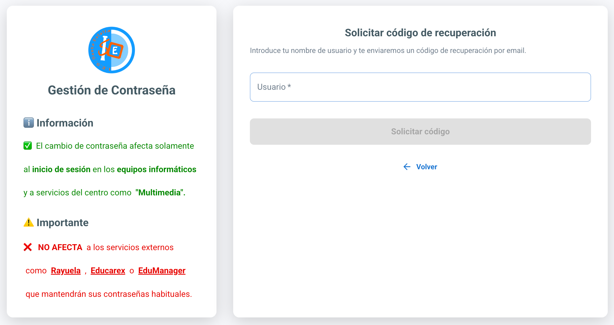
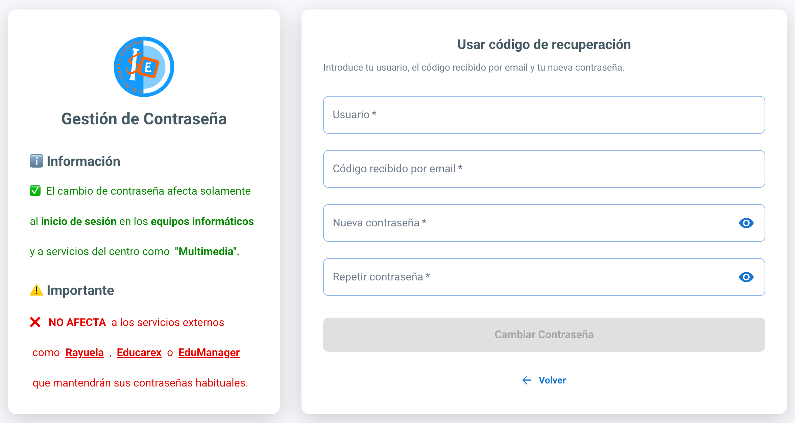
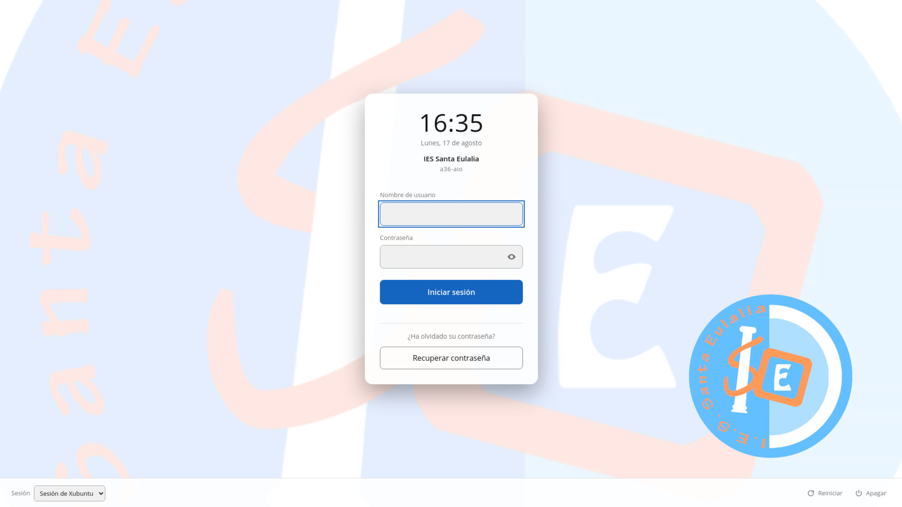
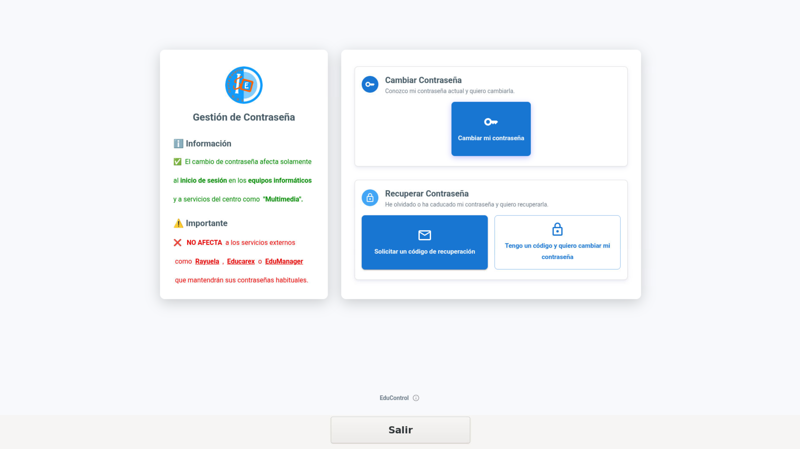

# Cambio de Contraseña

EduControl incluye una web pública, independiente del panel de administración, para que los propios usuarios del directorio puedan gestionar su contraseña sin depender de un administrador.

Está pensada principalmente para el **profesorado**, pero cualquier cuenta del directorio (también el alumnado) puede utilizarla.

## Acceso

La web se sirve en la ruta:

```
https://educontrol.santaeulalia/change-password
```

Es una página **totalmente pública**: no exige haber iniciado sesión en EduControl ni ningún tipo de autenticación previa. El panel izquierdo muestra el logo del centro y un mensaje informativo, ambos configurables por el administrador desde *Configuración → General*.

### Apertura automática desde el agente

Cuando un profesor inicia sesión en un equipo, si su contraseña está próxima a caducar (entre otros motivos), EduControl Agent instalado en ese equipo abrirá automáticamente la página de cambio de contraseña añadiendo parámetros a la URL, por ejemplo:

```
/change-password?uid=jperez&reason=expiring_soon&days=5
```

Según el motivo (`reason`) se muestra un aviso distinto: contraseña que **debe cambiarse** obligatoriamente, contraseña **ya caducada** o contraseña **próxima a caducar** (con los días restantes). De este modo, el usuario profesor será informado de que su contraseña debe ser actualizada.



## Opciones disponibles

Al entrar sin parámetros se muestra un menú con dos caminos:



### 1. Cambiar Contraseña

Pensado para cuando el usuario **recuerda su contraseña actual**. Pide:

- Usuario
- Contraseña actual
- Nueva contraseña (y su confirmación)



La contraseña actual se valida haciendo un *bind* contra el propio LDAP; si no es correcta, se avisa de ello y no se realiza ningún cambio.

### 2. Recuperar Contraseña

Pensado para cuando el usuario **no recuerda su contraseña actual**. Se resuelve en dos pasos independientes:

#### 2.1 Solicitar un código de recuperación

> Para que este envío funcione hace falta tener configurado el servidor de correo, tal y como se explica en [Mailing](./MAILING.md).

El usuario introduce únicamente su nombre de usuario. EduControl:



1. Genera un **código numérico de 6 dígitos**.
2. Lo envía por correo electrónico a la dirección que el usuario tiene registrada en LDAP.
3. El código queda **válido durante 24 horas** y es de **un solo uso**: al solicitar uno nuevo, el anterior deja de servir.

Por seguridad, si el usuario introducido no existe en el directorio se muestra el mismo mensaje que si la petición se hubiera cursado con éxito, de forma que la pantalla no permite averiguar qué nombres de usuario existen. Solo se informa de que no se encuentra el usuario cuando sí existe pero no tiene un correo asociado en LDAP.

Tras enviarse el código, la pantalla muestra el correo al que se ha enviado (parcialmente oculto, por ejemplo `jua***ez@dominio.com`) y pasa automáticamente al siguiente paso con el usuario ya prellenado.

#### 2.2 Cambiar la contraseña con el código

El usuario introduce el código de 6 dígitos recibido por correo junto con la nueva contraseña. Si el código no es válido o ha caducado, se informa del error y hay que solicitar uno nuevo desde el paso anterior.



## Recuperación desde la pantalla de inicio de sesión

Si un profesor tiene la cuenta bloqueada y no puede iniciar sesión en el equipo, no podrá abrir un navegador para acceder a `/change-password` por la vía habitual. Para este caso, la propia pantalla de inicio de sesión del equipo puede incorporar un botón **Recuperar contraseña** que abre directamente el portal de cambio de contraseña.



Esto requiere instalar en el equipo **recoverpass-greeter**, que sustituye la pantalla de acceso (greeter) por una versión ampliada con ese botón: al pulsarlo, lanza automáticamente una sesión restringida en modo kiosco con el navegador, abriendo directamente el portal de cambio de contraseña, sin barra de direcciones ni forma de navegar a otro sitio.



Como el equipo aún no ha iniciado sesión, el profesor deberá **consultar el código de recuperación recibido por correo desde su teléfono móvil**, ya que en el equipo bloqueado solo está disponible este portal en modo kiosco.

Una vez recuperada la contraseña, la sesión kiosco muestra en la parte inferior un botón **Salir** que la cierra y devuelve al equipo a la pantalla de inicio de sesión habitual, donde ya puede iniciar sesión con normalidad.

Las instrucciones de instalación y configuración están en el repositorio [manumora/recoverpass](https://github.com/manumora/recoverpass).

## Requisitos de la nueva contraseña

En ambos formularios (cambio con la contraseña actual y cambio con código) la nueva contraseña se valida en la propia web antes de enviarla, exigiendo como mínimo:

- 8 caracteres
- Una letra mayúscula
- Una letra minúscula
- Un número
- Un carácter especial

Un medidor de fortaleza acompaña al campo mientras se escribe. Estos requisitos son una guía para el usuario; la política que realmente se aplica en el directorio es la descrita en [Política de Contraseñas](./PASSWORD_POLICY.md), gestionada por el overlay **ppolicy** de LDAP.

## Auditoría

Tanto el cambio con contraseña actual como la solicitud y el uso de un código de recuperación quedan registrados en el módulo de Auditoría.

[Volver](../README.md)
