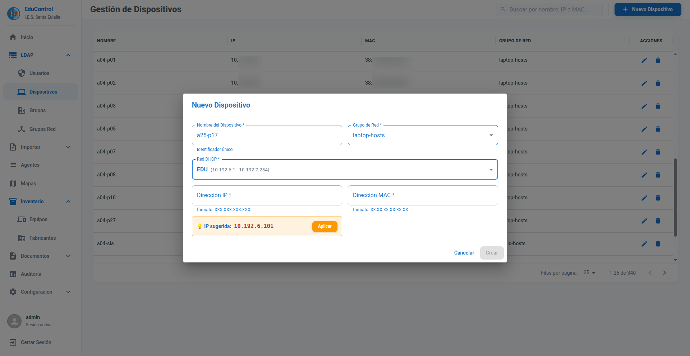

# Módulo de Integración LDAP

El módulo LDAP de EduControl permite la gestión centralizada de los servicios de directorio, facilitando la administración de identidades y recursos de red.

## Gestión de Operaciones (CRUD)

Desde la interfaz de EduControl, el administrador puede realizar operaciones completas de creación, lectura, actualización y borrado (CRUD) sobre los siguientes objetos del directorio:

### 1. Usuarios
Gestión integral de las cuentas de usuario de la organización. Permite administrar de forma centralizada quién tiene acceso a los sistemas, así como sus datos personales y credenciales.

### 2. Dispositivos
Administración de los objetos de equipo registrados en el directorio. Esta gestión es clave para que el sistema de autorenombrado de los agentes funcione correctamente.

- **Soporte Multired:** Permite registrar equipos asignando IPs tanto de la **red troncal** del centro como de la numeración IP de la **red WiFi Educarex**.
- **Gestión Inteligente de IPs:** Si al intentar registrar un nuevo equipo la dirección IP solicitada ya se encuentra ocupada, EduControl **recomienda automáticamente una IP alternativa** que esté libre, evitando conflictos de red.

### 3. Grupos de Red
Gestión de los grupos de red.

### 4. Grupos
Administración de grupos lógicos de usuarios. Permite organizar de forma funcional a los miembros del centro educativo: profesores, alumnos y personal no docente.

## Políticas de Contraseñas

EduControl gestiona desde la propia interfaz la política de contraseñas del directorio, que impone a los usuarios los requisitos de longitud, caducidad, historial y bloqueo por intentos fallidos. Se accede desde *Usuarios* → botón **Políticas**, en la barra superior, y el estado de cada cuenta puede consultarse desde el icono de historial de contraseñas del listado.

Consulta todos los detalles en la documentación de la [Política de Contraseñas](./PASSWORD_POLICY.md).

## Módulo de Importación

Además de la gestión manual, EduControl incorpora un módulo de importación masiva que vuelca en el directorio LDAP los datos exportados desde **Rayuela**, la plataforma educativa de la Junta de Extremadura.

El objetivo es dar de alta a todo el centro al comienzo del curso sin introducir los datos uno a uno, y mantener el directorio sincronizado con Rayuela a lo largo del año.

Todas las importaciones comparten el mismo comportamiento:

- **Progreso en tiempo real:** el avance se muestra en pantalla mediante WebSocket, registro a registro, según se van procesando.
- **Resumen final:** al terminar se presentan los contadores globales (creados, modificados, borrados, errores y omitidos) junto con el detalle de cada registro afectado.
- **Trazabilidad:** cada operación queda reflejada en el módulo de Auditoría y en el Histórico de importaciones.

### 1. Profesores
Importa el profesorado del centro a partir del fichero **XML de profesorado** exportado desde Rayuela.

Por cada profesor se crea su cuenta de usuario en LDAP con una contraseña generada automáticamente, que se muestra al administrador al finalizar para poder entregarla al interesado.

Opciones disponibles al lanzar la importación:

- **Borrar los que no estén en el fichero:** elimina del directorio los profesores que ya no aparecen en la exportación, útil para reflejar las bajas de principio de curso.
- **Crear carpeta personal:** genera el directorio personal del usuario en el servidor.
- **Enviar por webhook:** notifica los datos de cada profesor creado al webhook configurado, para integrarlo con sistemas externos.
- **Generar correo @educarex.es:** compone la dirección institucional cuando el fichero de origen no la incluye.

A los profesores importados se les aplica además la [política de contraseñas](./PASSWORD_POLICY.md) del centro, de forma que se les exijan los mismos requisitos de caducidad y complejidad que al resto de docentes.

### 2. Alumnos
Importa el alumnado a partir del **fichero ZIP** exportado desde Rayuela, que contiene el XML con los datos de los alumnos y sus fotografías.

Al igual que con los profesores, se crea la cuenta de cada alumno con su contraseña generada. La importación reconoce las fotografías incluidas en el ZIP y comprueba que exista la de cada alumno, informando de las que falten.

Su particularidad es que **crea automáticamente los cursos y grupos que no existan** en el directorio: si un alumno pertenece a un grupo aún no dado de alta, EduControl lo crea y lo asigna, evitando tener que prepararlos de antemano.

A los alumnos importados se les aplica además la [política de contraseñas](./PASSWORD_POLICY.md) `ppstudents` del centro.

Opciones disponibles:

- **Borrar los que no estén en el fichero:** da de baja a los alumnos que ya no figuran en la exportación.
- **Crear carpeta personal:** genera el directorio personal de cada alumno en el servidor.

### 3. Grupos
Importa la estructura académica del centro (cursos y sus grupos) desde el **XML de grupos** de Rayuela.

Por cada grupo se crea el objeto correspondiente en LDAP y se le asigna como responsable el **profesor tutor** indicado en el fichero, enlazando así la tutoría con la cuenta del docente. Los grupos ya existentes se actualizan si han cambiado de tutor o de denominación, y se corrige su estructura interna cuando es necesario.

Opción disponible:

- **Borrar los que falten:** elimina los grupos que ya no aparecen en la exportación.

### 4. Fotos
Importa de forma masiva las fotografías del profesorado y las almacena en el directorio, de modo que la foto quede disponible en toda la plataforma.

A diferencia de las anteriores, esta importación **no parte de un fichero de Rayuela sino de un conjunto de imágenes**, y sigue un proceso de validación previa en tres pasos:

1. **Selección:** se arrastran o seleccionan las imágenes. Se espera el formato de nombre `Apellidos, Nombre.jpg`, que es el que genera Rayuela.
2. **Emparejamiento:** EduControl compara el nombre de cada fichero con los profesores del directorio y propone la coincidencia más probable, indicando un **porcentaje de similitud**. La comparación no distingue mayúsculas ni tildes y tolera pequeñas diferencias, como abreviaturas del nombre.
3. **Validación e importación:** antes de guardar nada, el administrador revisa la propuesta en una tabla que muestra la miniatura de cada imagen, el profesor asignado y el grado de coincidencia. Cualquier asignación puede corregirse a mano, y las fotos que no interesen se pueden descartar. Sólo al confirmar se escriben en el directorio.

Detalles a tener en cuenta:

- **Umbral de similitud ajustable:** define a partir de qué porcentaje se acepta un emparejamiento automático. Al modificarlo, la tabla se recalcula al instante y respeta las asignaciones hechas a mano.
- **Aviso de sustitución:** los profesores que ya tienen fotografía aparecen marcados y se muestra la imagen actual junto a la nueva, para saber en todo momento qué se va a reemplazar. También es posible preseleccionar únicamente a quienes aún no tienen foto.
- **Optimización de las imágenes:** antes de guardarlas se convierten a JPEG y se reducen de tamaño (512 píxeles de lado mayor por defecto, configurable), evitando que el directorio crezca innecesariamente.

### 5. Histórico
Registro permanente de todas las importaciones realizadas. Mientras que el resumen que aparece al terminar una importación se pierde al salir de la pantalla, el histórico lo conserva y permite consultarlo en cualquier momento.

El listado principal recoge, por cada importación:

- La **fecha y hora** y el **usuario** que la lanzó.
- El **tipo** de importación (profesores, alumnos, grupos o fotos) y el fichero utilizado.
- Los **contadores globales**: registros procesados, creados, modificados, borrados y errores.
- El **estado** final: completada, completada con errores o error.

Desde el botón de detalle se accede al desglose completo de esa importación, con **una línea por cada registro afectado**: el profesor, alumno o grupo concreto, la acción realizada sobre él, los campos que cambiaron y el motivo en caso de error o de omisión. El detalle puede filtrarse por tipo de acción y buscarse por nombre o identificador, y **exportarse a Excel** para su revisión o archivo.

El histórico responde a preguntas habituales del día a día: cuándo se importó por última vez, qué alumnos se dieron de baja en una importación concreta o por qué falló el alta de un profesor determinado.

Las entradas pueden eliminarse manualmente y, para evitar que el registro crezca sin control, existe una **purga automática** que borra las importaciones más antiguas. El periodo de conservación se define en *Configuración → General* (365 días por defecto; el valor `0` desactiva la purga). Al eliminar una importación se borra también todo su detalle, sin que ello afecte a los usuarios ni a los grupos del directorio.

[Volver](../README.md)
