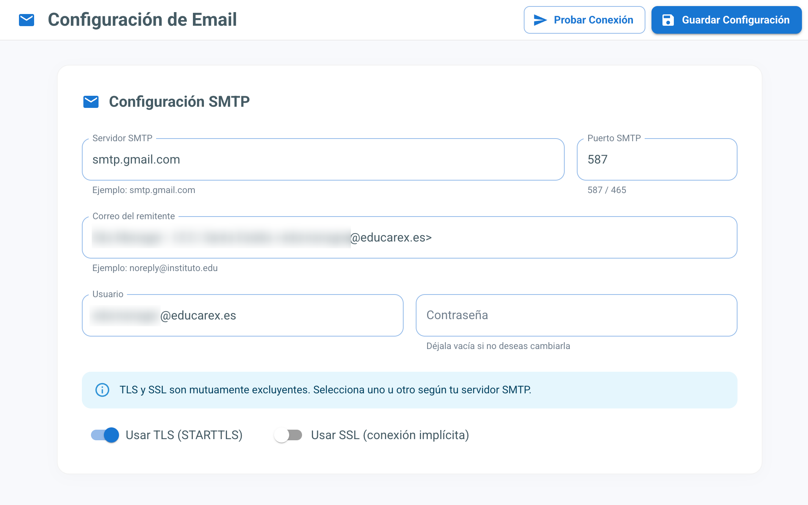
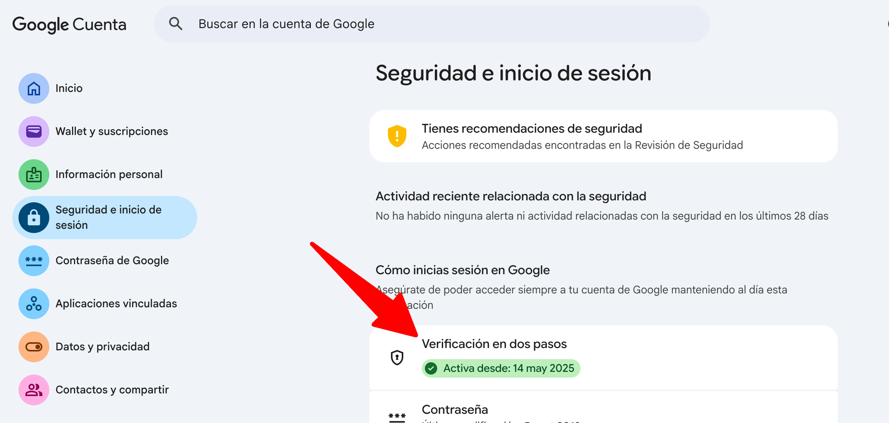
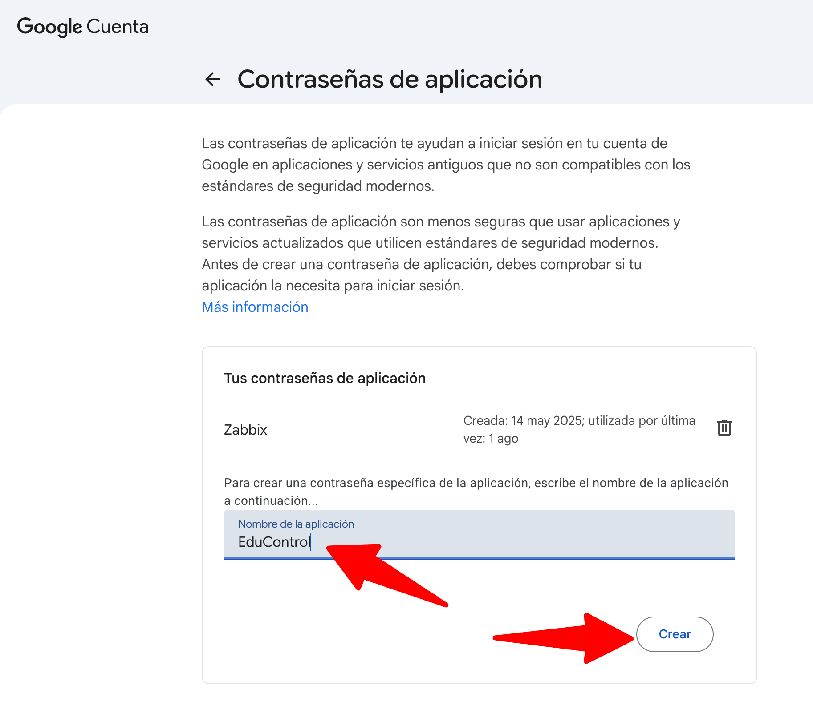
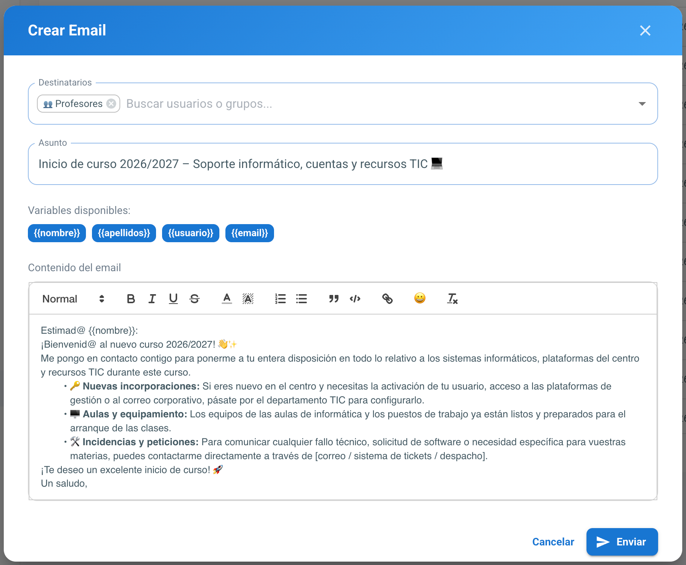

# Mailing

EduControl permite enviar correos electrónicos masivos a los usuarios del directorio (profesores, alumnos, personal no docente o grupos concretos) desde la propia plataforma, sin necesidad de un gestor de correo externo.

El módulo se compone de dos partes, ambas accesibles desde el menú lateral:

- **Mailing**: redacción de nuevos envíos y consulta del histórico.
- **Configuración → Mailing**: configuración del servidor SMTP que se usa para enviar los correos.

## Configuración del servidor de correo

Antes de poder enviar nada hay que dar de alta un servidor SMTP en *Configuración → Mailing*:

| Campo | Descripción | Valor por defecto |
| --- | --- | --- |
| Servidor SMTP | Dirección del servidor, por ejemplo `smtp.gmail.com` | — |
| Puerto SMTP | `587` para TLS, `465` para SSL | `587` |
| Correo del remitente | Dirección que aparecerá como remitente, por ejemplo `tu_correo@educarex.es` | — |
| Usuario | Usuario de autenticación SMTP | — |
| Contraseña | Contraseña de autenticación SMTP | — |
| Usar TLS (STARTTLS) | Conexión con cifrado TLS | Activado |
| Usar SSL (conexión implícita) | Conexión con cifrado SSL | Desactivado |

TLS y SSL son mutuamente excluyentes: activar uno desactiva automáticamente el otro, tanto en la propia pantalla como al guardar.

Por seguridad, la contraseña guardada nunca se muestra de vuelta en el formulario: el campo aparece siempre vacío y, si se deja así al guardar, se conserva la contraseña ya almacenada; solo se sobrescribe si se escribe una nueva.

### Probar Conexión

El botón **Probar Conexión** abre un diálogo que pide una dirección de correo de destino y envía un correo de prueba real (asunto *"EduControl - Email de Prueba"*) usando los datos que haya en ese momento en el formulario, aunque todavía no se hayan guardado. Es la forma recomendada de validar host, puerto, usuario, contraseña y modo TLS/SSL antes de dejar la configuración definitiva. Si el servidor SMTP rechaza la conexión o las credenciales, se muestra el error devuelto por el propio servidor de correo.

### Configurar una cuenta de Gmail/Educarex como servidor de correo

Tanto Gmail como el correo de Educarex (que se apoya en Google Workspace) exigen tener la **verificación en dos pasos (2FA)** activada en la cuenta para poder generar una **contraseña de aplicación**, que es la que hay que usar en el campo "Contraseña" de EduControl en lugar de la contraseña habitual de la cuenta:

1. Entra en la gestión de la cuenta de Google (**Gestionar tu cuenta de Google** → [**Seguridad e inicio de sesión**](https://myaccount.google.com/security)) con la cuenta de correo que se va a usar como remitente.
2. Activa la **Verificación en dos pasos** si todavía no lo está. Es un requisito imprescindible: sin 2FA activo, Google no permite crear contraseñas de aplicación.

3. Dentro de **Seguridad e inicio de sesión**, entra en [**Contraseñas de aplicaciones**](https://myaccount.google.com/apppasswords) y genera una nueva, indicando un nombre orientativo como "EduControl".

4. Google mostrará una contraseña de 16 caracteres: es la que hay que copiar en el campo **Contraseña** del formulario de EduControl. No se vuelve a mostrar después, así que si se pierde hay que generar una nueva.
5. Completa el resto de campos con:
   - **Servidor SMTP**: `smtp.gmail.com`
   - **Puerto**: `587` con **TLS** activado (o `465` con **SSL** activado)
   - **Usuario**: la dirección completa de correo (por ejemplo, `tu_correo@educarex.es`)
   - **Correo del remitente**: normalmente la misma dirección
6. Guarda y usa **Probar Conexión** para confirmar que el envío funciona antes de darlo por definitivo.

## Cómo se procesan los envíos

Cada correo que se envía desde EduControl se registra como un elemento independiente y se procesa de forma asíncrona, en segundo plano, para no bloquear la interfaz aunque el envío sea a muchos destinatarios:

- Cada correo pasa por tres estados posibles: **Pendiente**, **Enviado** o **Fallido**.
- Si el envío falla por un problema puntual de conexión con el servidor SMTP, EduControl lo reintenta automáticamente hasta 3 veces, con 1 minuto de espera entre cada intento, antes de marcarlo como fallido.
- Cada 5 minutos se revisan los correos que hayan podido quedar en estado "Pendiente" y se reintenta su envío.
- Los correos marcados como "Fallido" se eliminan automáticamente del histórico pasados 7 días, para no acumular registros de errores antiguos indefinidamente.

## Envío de correos (Mailing → Crear)

Desde *Mailing* → botón **Crear** se abre el formulario de redacción:

- **Destinatarios**: un buscador combinado que permite añadir **usuarios individuales** (cualquier cuenta LDAP que tenga un correo asociado), **grupos** del centro (al elegir uno, el correo se envía a todos sus miembros) y tres **colectivos** predefinidos —**Profesores**, **Alumnos** y **Personal no docente**—, que envían el correo a todos los usuarios de ese tipo sin tener que seleccionarlos uno a uno ni depender de que exista un grupo LDAP que los agrupe.
- **Asunto**: campo de texto simple.
- **Variables disponibles**: `{{nombre}}`, `{{apellidos}}`, `{{usuario}}` y `{{email}}`, que EduControl sustituye automáticamente por los datos de cada destinatario tomados de su ficha LDAP, de forma que un mismo envío llega personalizado a cada persona.
- **Cuerpo del mensaje**: editor de texto enriquecido con formato (negrita, cursiva, subrayado, tachado, colores, listas, citas, bloques de código, enlaces y emojis), es decir, admite HTML con el mismo aspecto que se ve mientras se redacta. No hay un botón de vista previa aparte porque el propio editor ya muestra el resultado final.
- No se pueden adjuntar ficheros al correo.

Al confirmar el envío, se valida que haya al menos un destinatario, un asunto y un cuerpo no vacíos, y EduControl encola un correo independiente por cada destinatario final (si se ha elegido un grupo, uno por cada miembro).

## Histórico de envíos

La pantalla de *Mailing* muestra un listado paginado con todos los correos enviados, con las columnas:

- **Nombre** y **Email** del destinatario.
- **Asunto**.
- **Estado**: Pendiente, Enviado o Fallido, cada uno con su propio color.
- **Fecha** de creación del envío.

Puede filtrarse por texto libre (busca en destinatario y asunto) y por estado. Pulsando el icono de detalle de una fila se abre una ficha con: el destinatario y el colectivo al que pertenece (Profesor, Alumno, Personal no docente u Otro, calculado igual que en el resto de la plataforma a partir de su directorio personal), el estado y la fecha, el asunto, el contenido del correo tal como se envió, y, si falló, el mensaje de error devuelto por el servidor SMTP.

[Volver](../README.md)
