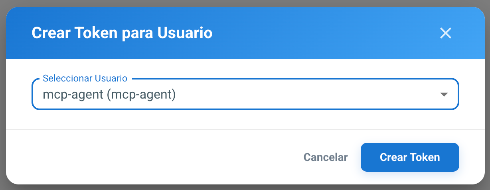

# Servidor MCP

## ¿Qué es el servidor MCP?

EduControl incluye un servidor [MCP (Model Context Protocol)](https://modelcontextprotocol.io/), que permite a cualquier agente LLM compatible interactuar con la plataforma de forma estructurada y segura.

El servidor expone dos grupos de capacidades al agente:

- **Herramientas de terminal**: permiten abrir sesiones de terminal interactivas en cualquier agente registrado, enviar comandos y recibir la salida limpia (sin secuencias ANSI ni ruido de WebSocket).
- **Herramientas de consulta REST** (solo lectura): permiten buscar usuarios, grupos, equipos, inventario, mapas y aulas, tareas y registros de auditoría directamente desde el agente LLM.
- **Herramientas de gestión de tareas y programaciones**: permiten crear, modificar, borrar y lanzar tareas, y programarlas con expresiones cron. Borrar, lanzar y programar pasan por la misma confirmación humana que los comandos arriesgados.

El LLM nunca ve frames WebSocket en bruto, códigos de escape ANSI ni respuestas HTTP sin procesar — el servidor se encarga de traducir todo a estructuras limpias de petición/respuesta.

## Casos de uso

- Administrar una flota de equipos desde un chat con un agente LLM (por ejemplo, Claude Desktop, Cursor, etc.).
- Consultar el estado de los agentes, el inventario o los usuarios LDAP en lenguaje natural.
- Resolver preguntas de ubicación en lenguaje natural («¿qué curso está en el aula 25?», «¿qué equipos hay en 1B y cuáles están encendidos?»).
- Revisar qué tareas hay configuradas, cuándo se ejecutaron por última vez y qué falló en cada equipo.
- Crear o ajustar una tarea y lanzarla sobre un aula completa, con confirmación humana previa y viendo antes el contenido exacto que se va a ejecutar.
- Programar una tarea («todas las noches a las cuatro en el aula 25») y comprobar después por qué una programación no ha saltado: si está pausada, si tiene cron o cuándo le toca.
- Ejecutar comandos en uno o varios equipos simultáneamente, con confirmación humana obligatoria para operaciones de riesgo.
- Auditar qué comandos se han ejecutado y cuándo, desde el propio registro del servidor MCP.

## Configuración

### 1. Crear token API en EduControl para el servidor MCP

El usuario Django `mcp-agent` se crea automáticamente al instalar EduControl. Solo hay que crear el token desde *Configuración → Tokens API*, seleccionando el usuario `mcp-agent` y pulsando **Crear Token**:



Este token será usado por el Servidor MCP para tener acceso a la API de EduControl.

### 2. Generar el token del gateway MCP

Es un token distinto del creado en el paso 1, este es el que el Agente de IA (cliente MCP) debe tener para poder conectarse al Servidor MCP. Genera uno nuevo:

```bash
openssl rand -hex 32
```

### 3. Configurar las variables de entorno

En el fichero `.env` (que está junto al fichero `docker-compose.yaml`), añade:

```bash
EDUCONTROL_API_TOKEN=<token-cuenta-de-servicio-mcp-agent>         # paso 1
EDUCONTROL_MCP_GATEWAY_TOKEN=<token-generado-en-el-paso-2>        # paso 2
```

Además, el contenedor `mcp_server` necesita poder hablar con el `backend` por la red interna de Docker, así que `backend` tiene que estar incluido en `DJANGO_ALLOWED_HOSTS` (en el mismo `.env`), junto al resto de nombres/IPs que ya tengas:

```bash
DJANGO_ALLOWED_HOSTS=localhost 127.0.0.1 backend 172.23.36.2 educontrol.santaeulalia
```

### 4. Recrear los contenedores

```bash
docker compose up -d
```

### 5. Configurar tu agente IA

El agente se conecta a `https://<host>:8443/mcp` con el transporte Streamable HTTP y la cabecera `Authorization: Bearer <EDUCONTROL_MCP_GATEWAY_TOKEN>`. Por ejemplo, en [opencode](https://opencode.ai/):

```json
"mcp": {
  "educontrol": {
    "type": "remote",
    "url": "https://<host>:8443/mcp",
    "headers": {
      "Authorization": "Bearer <EDUCONTROL_MCP_GATEWAY_TOKEN>"
    }
  }
}
```

> Si no se configuran los pasos 2-4, el contenedor `mcp_server` arranca igualmente (sin crashear) y rechaza todas las peticiones con `503`. El sitio principal no se ve afectado en ningún caso.

## Comandos arriesgados y confirmación humana

El servidor incluye un sistema de detección de comandos potencialmente peligrosos (`config/risky_patterns.yaml`). Cuando `send_command` detecta un patrón de riesgo, no ejecuta el comando inmediatamente: devuelve una solicitud de confirmación con un `confirm_token`. El agente LLM debe solicitar confirmación explícita al operador humano antes de llamar a `confirm_and_send_command`.

El mismo mecanismo protege las tareas: `execute_task` y `delete_task_definition` devuelven también `confirmation_required` con un `confirm_token`, y la acción solo se lleva a cabo al llamar a `confirm_task_action`. La diferencia es que en las tareas la confirmación es **obligatoria siempre**, coincida o no el contenido con un patrón de riesgo; los patrones solo sirven para explicar por qué ese lanzamiento concreto es más peligroso, y para marcar con `risk_warning` una tarea recién creada o modificada.

Para personalizar los patrones de riesgo, edita `mcp_server/config/risky_patterns.yaml` — son expresiones regulares con descripción, sin necesidad de modificar código.

## Auditoría

Cada llamada a herramienta y cada comando ejecutado se registra en `logs/audit.log` (una línea JSON por evento), independientemente del resultado. Los eventos de ejecución de comandos incluyen agente, sesión, comando y estado; los de consulta incluyen nombre de herramienta, parámetros y estado.

## Detalle del acceso mediante el gateway MCP

El servidor MCP se despliega como un contenedor más de `docker-compose.yaml` (`mcp_server`), sin ningún puerto propio expuesto: solo es accesible a través de Nginx, en el puerto **8443**, con cuatro capas de seguridad independientes:

1. **TLS** — bloque Nginx en el puerto 8443, reutilizando el mismo certificado que el sitio principal.
2. **Lista blanca de IPs** (opcional) — ver más abajo.
3. **Token de gateway** — `EDUCONTROL_MCP_GATEWAY_TOKEN`; el servidor MCP lo comprueba en cada petición, independientemente de Nginx.
4. **Rate limiting** — 60 peticiones/minuto con burst de 10, a nivel de Nginx.

Esto se aplica igual estés conectando el agente IA desde el propio servidor o desde otra máquina: al no haber otro puerto expuesto, siempre se pasa por esta vía.

### Lista blanca de IPs (opcional)

La variable `MCP_CLIENT_FIXED_IP`, en el `.env` raíz, restringe qué direcciones pueden llegar al puerto 8443 (admite varias, separadas por comas o espacios):

```bash
MCP_CLIENT_FIXED_IP=<IP-fija-del-cliente-MCP>
```

Si se deja vacía o sin definir, se permite cualquier IP y el token de gateway pasa a ser el único control de acceso. Tras cambiarla hay que recrear el contenedor `frontend`: `docker compose up -d frontend`.

### Flujo de autenticación

```
Cliente MCP (IP fija)
    │  HTTPS, puerto 8443
    ▼
┌─────────────── Nginx (contenedor frontend) ─────────────────┐
│  1. TLS (certificado autofirmado, igual que el sitio)       │
│  2. mcp_allow.conf (desde MCP_CLIENT_FIXED_IP) → 403 si IP ∉ lista │
│  3. Rate limiting: 60 req/min, burst 10         → 429       │
│        │ proxy_pass → mcp_server:8000/mcp (red interna)     │
└────────┼────────────────────────────────────────────────────┘
         ▼
┌─────────────── Contenedor mcp_server (sin puertos propios) ─┐
│  4. GatewayTokenMiddleware: Authorization: Bearer <token>   │
│     → 401 si falta o es incorrecto                          │
│        │                                                    │
│        ▼                                                    │
│   Capa MCP (Streamable HTTP) → ejecución de herramientas    │
│        │                                                    │
│        ▼                                                    │
│   Llamadas salientes a la API de EduControl con             │
│   EDUCONTROL_API_TOKEN (credencial distinta al token gateway)│
└─────────────────────────────────────────────────────────────┘
```

### Rotación del token de gateway

Es una medida de seguridad: cambiar el token periódicamente, o en cuanto se sospeche que ha podido filtrarse, limita el tiempo durante el que una credencial expuesta seguiría siendo válida.

1. Generar un nuevo valor: `openssl rand -hex 32`.
2. Actualizar `EDUCONTROL_MCP_GATEWAY_TOKEN` en `.env`.
3. `docker compose up -d mcp_server` (solo este contenedor necesita reiniciarse).
4. Comunicar el nuevo valor al cliente MCP fuera de banda. No hay ventana de solapamiento: el token antiguo deja de funcionar en cuanto termina el reinicio.

### Firewall del host (ufw/iptables)

Además de la lista blanca de Nginx, es recomendable añadir una regla equivalente en el firewall del host (defensa en profundidad):

```bash
# ufw
sudo ufw allow from <MCP_CLIENT_FIXED_IP> to any port 8443 proto tcp
sudo ufw deny 8443/tcp
sudo ufw status numbered   # comprobar que la regla allow está ANTES que la deny

# iptables
sudo iptables -A INPUT -p tcp -s <MCP_CLIENT_FIXED_IP> --dport 8443 -j ACCEPT
sudo iptables -A INPUT -p tcp --dport 8443 -j DROP
```

## Herramientas disponibles

### Herramientas de terminal

| Herramienta | Descripción |
|---|---|
| `open_terminal_session(agent_id)` | Abre una sesión de terminal en un agente; devuelve un `session_id` |
| `send_command(session_id, command, timeout_s=10)` | Ejecuta un comando; devuelve la salida limpia, o una solicitud de confirmación si el comando es arriesgado |
| `confirm_and_send_command(session_id, confirm_token)` | Ejecuta un comando previamente bloqueado por `send_command`, solo tras confirmación humana |
| `close_terminal_session(session_id)` | Cierra la sesión |
| `get_session_status(session_id)` | Devuelve `{connected, agent_id, last_activity}` |
| `send_command_to_multiple(agent_ids, command, timeout_s=10)` | Ejecuta un comando en varios agentes a la vez; una sola confirmación cubre todo el lote |
| `confirm_and_send_command_to_multiple(confirm_token)` | Ejecuta el comando de flota previamente bloqueado, tras confirmación humana |

### Herramientas de consulta (solo lectura)

| Herramienta | Descripción |
|---|---|
| `search_users(query, user_type, limit)` | Busca usuarios LDAP por nombre, uid o número de empleado |
| `get_user_details(uid)` | Perfil completo de un usuario, con sus grupos de departamento/curso |
| `search_groups(query, group_type, limit)` | Busca grupos LDAP (departamentos/clases) |
| `get_group_members(cn, limit)` | Lista los miembros de un grupo |
| `search_hosts(query, limit)` | Busca registros de host LDAP (DNS/DHCP) |
| `get_host_details(dc)` | Detalle DNS/DHCP de un host |
| `search_inventory_items(query, online, location_id, manufacturer, model, tag, limit)` | Busca equipos del inventario |
| `get_inventory_item_details(computer_id)` | Detalle completo de un equipo del inventario |
| `search_agents(online_only, location_id, tag, limit)` | Lista agentes conectados |
| `get_agent_details(agent_id)` | Estado y metadatos completos de un agente (sin credenciales VNC) |
| `list_maps(limit)` | Lista los mapas del centro (plantas/edificios) con su número de puntos |
| `search_map_points(query, course, map_id, point_type, limit)` | Busca aulas y puntos por nombre o curso; devuelve el `location_id` que usan las herramientas de agentes e inventario |
| `get_map_point_details(point_id)` | Detalle de un punto, incluidos los ids de los equipos ubicados en él |
| `search_task_definitions(query, task_type, category_id, limit)` | Busca tareas configuradas (sin el cuerpo del script) |
| `get_task_definition_details(task_id)` | Detalle de una tarea, incluido el comando o script que ejecuta |
| `search_task_executions(task_id, status, limit)` | Lista ejecuciones de tareas, de más reciente a más antigua |
| `get_task_execution_details(execution_id, only_failed, device_limit)` | Resultado por equipo de una ejecución (stdout/stderr recortados a 2000 caracteres) |
| `get_task_history_summary(limit)` | Una fila por tarea: ejecuciones totales, última ejecución y estado, próxima ejecución programada |
| `list_task_categories(limit)` | Categorías de tareas, para el filtro `category_id` |
| `search_schedules(query, task_id, active, limit)` | Busca programaciones por nombre o tarea; filtra por activas/pausadas |
| `get_schedule_details(schedule_id)` | Detalle de una programación: expresiones cron, destinos, última y próxima ejecución |
| `search_audit_log(query, username, entity_type, action, success, date_from, date_to, limit)` | Busca en el registro de auditoría de operaciones de escritura |
| `get_audit_log_for_agent(agent_id, limit)` | Entradas de auditoría de un agente concreto |

Todas las herramientas de esta tabla son de solo lectura (`GET`). Ninguna crea, modifica ni elimina datos. Los resultados están limitados a un máximo de 100 elementos.

### Herramientas de gestión de tareas y programaciones (escritura y ejecución)

Son las únicas herramientas REST que modifican datos, y la única vía además del terminal que provoca que se ejecute código en máquinas reales.

| Herramienta | Descripción |
|---|---|
| `create_task_definition(name, content, task_type, description, category_id, timeout)` | Crea una tarea; devuelve `risk_warning` si el contenido guardado coincide con un patrón de riesgo |
| `update_task_definition(task_id, name, content, task_type, description, category_id, timeout)` | Actualización parcial: solo cambia los campos que se pasen |
| `delete_task_definition(task_id)` | **Requiere confirmación.** Borrar una tarea arrastra en cascada todo su historial de ejecuciones |
| `execute_task(task_id, agent_ids, location_ids)` | **Requiere confirmación siempre.** Devuelve el contenido que se ejecutaría y los destinos resueltos |
| `terminate_task_execution(execution_id)` | Detiene una ejecución pendiente o en curso; sin confirmación, es el freno de emergencia |
| `create_schedule(name, task_id, crontabs, computer_ids, point_ids, is_active)` | **Requiere confirmación.** Programa una tarea con una o varias expresiones cron |
| `update_schedule(schedule_id, name, task_id, crontabs, computer_ids, point_ids, is_active)` | **Requiere confirmación**, también al reactivar. Las listas se sustituyen, no se fusionan |
| `delete_schedule(schedule_id)` | **Requiere confirmación.** Elimina la programación y sus entradas cron; el historial se conserva |
| `pause_schedule(schedule_id)` | Desactiva una programación; sin confirmación y reversible |
| `confirm_task_action(confirm_token)` | Ejecuta la acción que quedó bloqueada; el token recuerda cuál era |

> **Ojo con los identificadores de destino**: `execute_task` recibe `agent_ids` (cadenas tipo `agent_963f...`, porque un lanzamiento puntual va a quien esté conectado ahora), mientras que las programaciones reciben `computer_ids` y `point_ids` (enteros, porque una programación sobrevive a cualquier conexión y se ancla a filas de la base de datos). No son intercambiables.

> **Cron y zona horaria**: las herramientas aceptan expresiones cron normales de 5 campos (`minuto hora día-del-mes mes día-de-la-semana`, p. ej. `"0 4 * * *"` para las 04:00 diarias) y las traducen al formato de la API, validando antes el número de campos: la API rellena con `*` cualquier campo que falte, así que una expresión de 4 campos se convertiría en silencio en una programación mucho más frecuente. La zona horaria es la que tenga configurada el servidor (`CELERY_TIMEZONE`) y **no se puede fijar por programación**; en cambio `last_run` y `next_run` vienen en UTC.

> **Cómo funciona la confirmación**: el contenido de una tarea es Bash arbitrario, así que lanzarla equivale a ejecutar un comando de terminal y pasa por **la misma** puerta de confirmación (`risk.py`). Las herramientas marcadas arriba no actúan en la primera llamada: devuelven `confirmation_required` con un token de un solo uso y 2 minutos de validez. Solo `confirm_task_action` ejecuta la acción, y el agente LLM debe pedir antes una autorización explícita al operador humano.
>
> A diferencia de `send_command`, **la ejecución exige confirmación aunque el contenido no coincida con ningún patrón de riesgo**: el LLM no ha escrito ese contenido y `location_ids` puede expandirse a un aula entera en el servidor. El borrado de una tarea está protegido porque `TaskExecution.task` es `on_delete=CASCADE`. Y las programaciones se protegen con más motivo, no con menos: una programación ejecuta la tarea de forma repetida y desatendida, a horas en las que nadie mira la salida — por eso `update_schedule` también pide confirmación cuando lo único que hace es volver a activarla.
>
> Los frenos, en cambio, **no** piden confirmación a propósito: `terminate_task_execution` (detiene una ejecución en curso) y `pause_schedule` (desactiva una programación, de forma reversible).
>
> Los tokens de terminal y los de tareas/programaciones son de almacenes distintos: un token emitido para un comando no sirve para confirmar el borrado de una tarea.

> **No expuesto**: `POST /tasks/executions/{id}/retry/` (reintento por dispositivo), `/tasks/wol/execute/` (Wake-on-LAN, accesible como una tarea normal de tipo `wake_on_lan`) y `POST /schedules/{id}/execute/` — este último porque la vista ejecuta la tarea y después devuelve `None`, lo que Django convierte en un 500: el trabajo se hace pero al llamante se le dice que ha fallado. Para un lanzamiento manual, `execute_task`.
