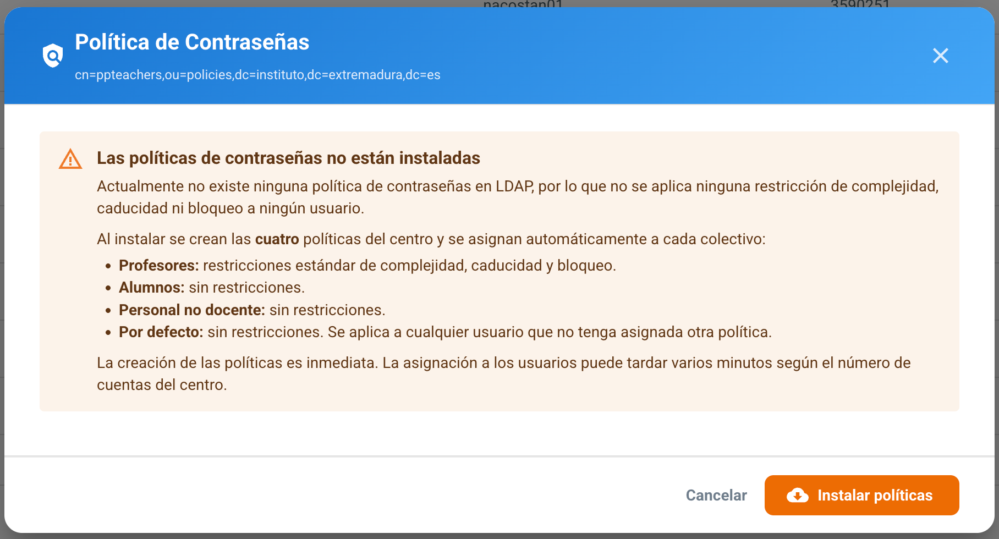
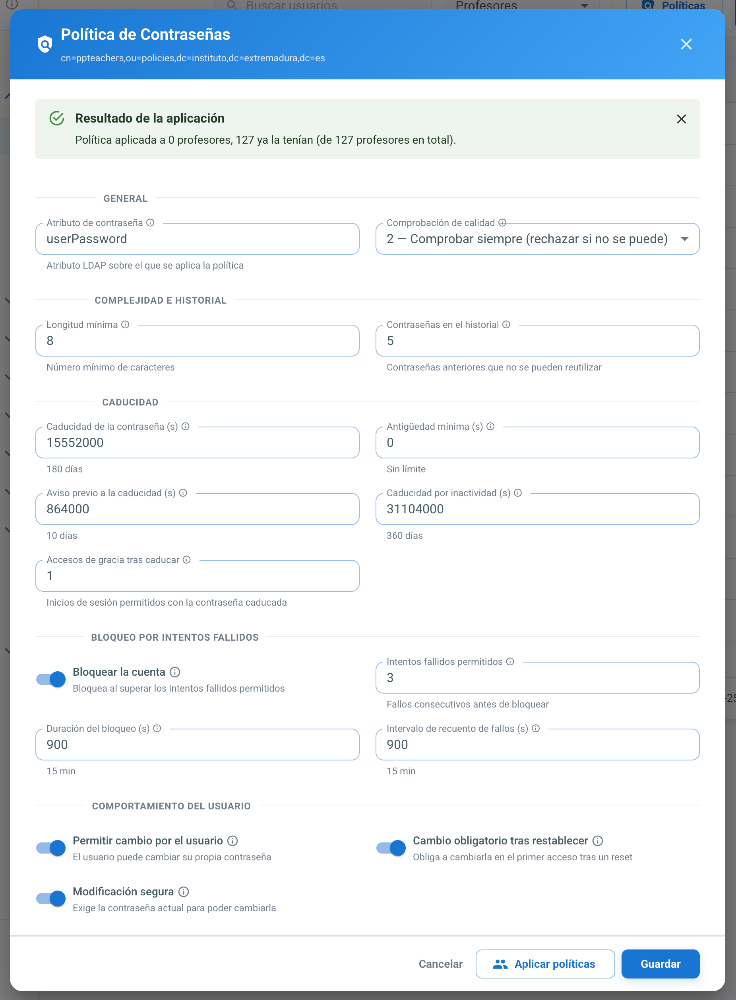
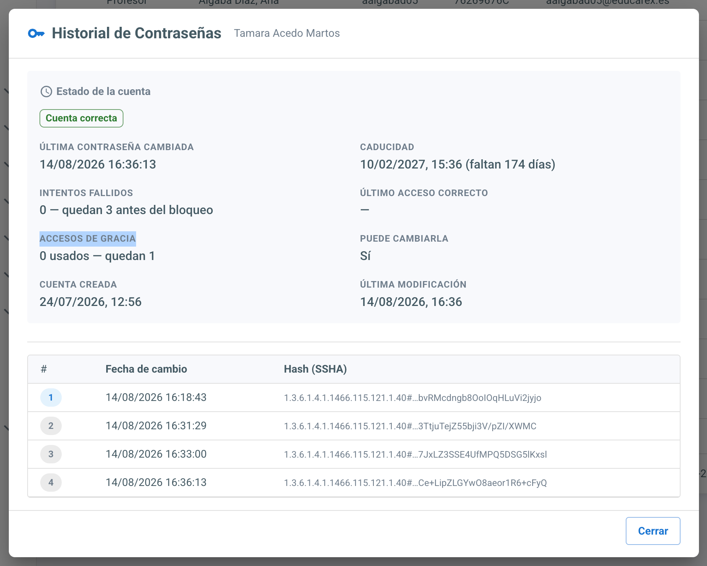

# Política de Contraseñas

EduControl gestiona desde la propia interfaz la **política de contraseñas del directorio**, que es la que impone a los usuarios los requisitos de longitud, caducidad, historial y bloqueo por intentos fallidos.

La política se corresponde con una entrada `pwdPolicy` del directorio:

```
cn=ppteachers,ou=policies,dc=instituto,dc=extremadura,dc=es
```

Es el *overlay* **ppolicy** de OpenLDAP quien la aplica realmente: EduControl se limita a crearla, editarla y asignarla a los usuarios mediante el atributo `pwdPolicySubentry` de cada cuenta.

Se accede desde *LDAP* → *Usuarios*, botón **Políticas**, en la barra superior.

## 1. Instalación

Si la entrada no existe en el directorio, el diálogo no muestra el formulario: únicamente informa de que la política **no está instalada** y advierte de que, mientras siga así, no se aplica ninguna restricción de complejidad, caducidad ni bloqueo a las cuentas.



Con el botón **Instalar políticas** EduControl:

1. Crea la rama `ou=policies` si todavía no existiera.
2. Crea el objeto `pwdPolicy` con los valores por defecto de la tabla siguiente.
3. **Aplica la política a todos los profesores** e informa a cuántos se les ha asignado.

Los valores por defecto con los que se crea son:

| Atributo | Valor | Significado |
| --- | --- | --- |
| `pwdAttribute` | `userPassword` | Atributo sobre el que se aplica la política |
| `pwdCheckQuality` | `2` | Comprueba siempre la calidad y rechaza la contraseña si no puede comprobarla |
| `pwdMinLength` | `8` | Longitud mínima en caracteres |
| `pwdInHistory` | `5` | Contraseñas anteriores que no se pueden reutilizar |
| `pwdMaxAge` | `15552000` | Caduca a los 180 días |
| `pwdMinAge` | `0` | Sin espera para volver a cambiarla |
| `pwdExpireWarning` | `864000` | Avisa al usuario 10 días antes de que caduque |
| `pwdMaxIdle` | `31104000` | Bloquea la cuenta tras 360 días sin uso |
| `pwdGraceAuthNLimit` | `1` | Un único acceso de gracia con la contraseña caducada |
| `pwdLockout` | `TRUE` | Bloquea la cuenta al superar los intentos fallidos |
| `pwdMaxFailure` | `3` | Fallos consecutivos antes de bloquear |
| `pwdLockoutDuration` | `900` | El bloqueo dura 15 minutos |
| `pwdFailureCountInterval` | `900` | Los fallos se olvidan a los 15 minutos |
| `pwdAllowUserChange` | `TRUE` | El usuario puede cambiar su propia contraseña |
| `pwdMustChange` | `TRUE` | Obliga a cambiarla en el primer acceso tras un restablecimiento |
| `pwdSafeModify` | `TRUE` | Exige la contraseña actual para poder cambiarla |

## 2. Edición

Una vez instalada, el diálogo muestra el formulario con la configuración vigente, agrupada en cinco bloques: general, complejidad e historial, caducidad, bloqueo por intentos fallidos y comportamiento del usuario.



Todos los valores son editables y se guardan directamente en el directorio. Los campos expresados en segundos, tal y como los almacena LDAP, muestran debajo su equivalencia en días, horas y minutos para no tener que calcularla a mano.

Cada modificación queda registrada en el módulo de Auditoría con el detalle de los atributos que han cambiado.

Los cambios se aplican al momento a todos los profesores que ya tengan la política asignada: no hace falta volver a aplicarla.

## 3. Aplicación a los profesores

Crear la política no basta: cada cuenta debe apuntar a ella. El botón **Aplicar políticas** recorre el directorio y asigna la política a **todos los profesores**, entendiendo por tales los usuarios cuyo directorio personal cuelga de `/home/profesor`, el mismo criterio con el que la plataforma calcula el tipo de usuario.

Al terminar informa de a cuántos profesores se ha aplicado, cuántos ya la tenían y cuántos han fallado, con el detalle de los errores en su caso. Los usuarios que ya la tenían asignada no se modifican.

Es una operación que puede repetirse cuantas veces se quiera: conviene lanzarla después de dar de alta profesores fuera de las importaciones, ya que las importaciones de Rayuela y el alta manual de usuarios ya la asignan por su cuenta.

En el módulo de [importación de profesores](./LDAP.md#módulo-de-importación) la asignación también se realiza automáticamente, pero ahí es opcional: un switch **Aplicar políticas de contraseñas**, activado por defecto, permite desmarcarla para ese envío en concreto. El switch aparece deshabilitado, con un icono de información explicando el motivo, cuando la política todavía no está instalada en el directorio.

## 4. Estado de la cuenta de un usuario

Desde el listado de usuarios, el icono de **historial de contraseñas** de cada fila abre el detalle de esa cuenta: la fecha del último cambio, las contraseñas anteriores registradas por el directorio y, sobre todo, **el estado que impone la política**.



El panel de estado responde a las preguntas del día a día:

- Si la cuenta está **bloqueada**, desde cuándo y si se desbloqueará sola o el bloqueo es indefinido.
- Cuántas veces se ha **fallado la contraseña** y cuántos intentos quedan antes del bloqueo. Sólo se cuentan los fallos vigentes: los anteriores al intervalo de recuento ya han caducado.
- Cuándo **caduca la contraseña** y cuánto falta, o si no caduca nunca.
- Si el usuario **debe cambiarla** por habérsela restablecido un administrador.
- El **último acceso correcto**, los **accesos de gracia** consumidos, desde cuándo puede volver a cambiarla y las fechas de creación y última modificación de la cuenta.

Cuando la cuenta está bloqueada aparece el botón **Desbloquear**, que borra el bloqueo y el contador de intentos fallidos sin esperar a que venza el plazo. La operación queda registrada en el módulo de Auditoría.

La pantalla avisa además cuando el usuario **no tiene la política asignada** —y permite aplicársela individualmente— o cuando la política no existe todavía en el directorio.

> El estado se obtiene de los atributos operativos que mantiene el overlay ppolicy. Si el directorio no los devuelve (porque las ACL no lo permiten, o porque el usuario no ha cambiado nunca su contraseña), el panel lo indica expresamente en lugar de dar la cuenta por correcta.

## 5. Avisos en el listado

Las filas del listado de usuarios muestran un icono de aviso cuando la cuenta necesita atención: **candado rojo** si está bloqueada, **triángulo ámbar** si la contraseña caduca pronto o ya ha caducado, y un icono azul si el usuario debe cambiarla. Al pulsarlo se abre el detalle de esa cuenta.

Estos avisos se consultan aparte del listado, de modo que la tabla se muestra igual de rápido que antes y los iconos aparecen un instante después.

[Volver](../README.md)
