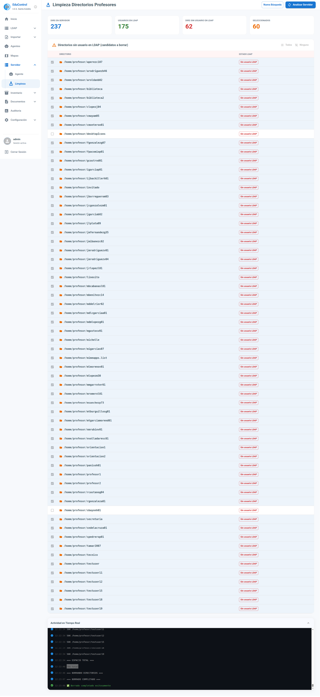

# Módulo del Servidor

Este módulo permite realizar el mantenimiento del servidor principal del centro educativo directamente desde la plataforma.

## Operaciones de Mantenimiento

Desde EduControl se llevarán a cabo diferentes operaciones de mantenimiento para asegurar el correcto funcionamiento del sistema, tales como:

- **Limpieza de Certificados Puppet:** Ante bloqueos del agente Puppet por certificados caducados o erróneos, el servidor EduControl gestiona su eliminación en el Servidor Principal a petición del agente afectado para su autoreparación. [+info](AGENTS.md#5-resoluci%C3%B3n-de-problemas-de-certificados-puppet)

- **Limpieza de Home Profesor:** Eliminación de los directorios personales de los profesores que ya no son usuarios del centro.

[Volver](../README.md)
