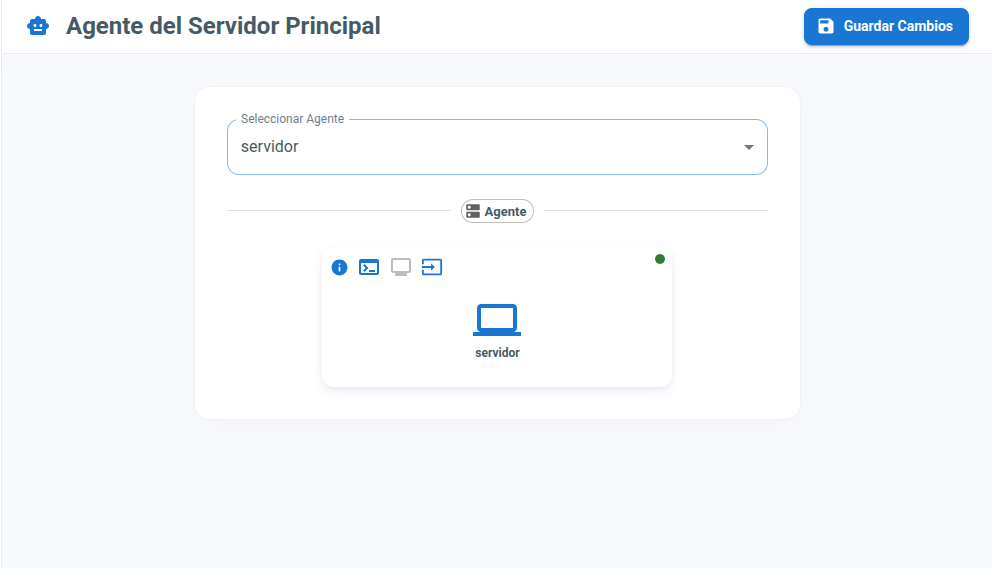
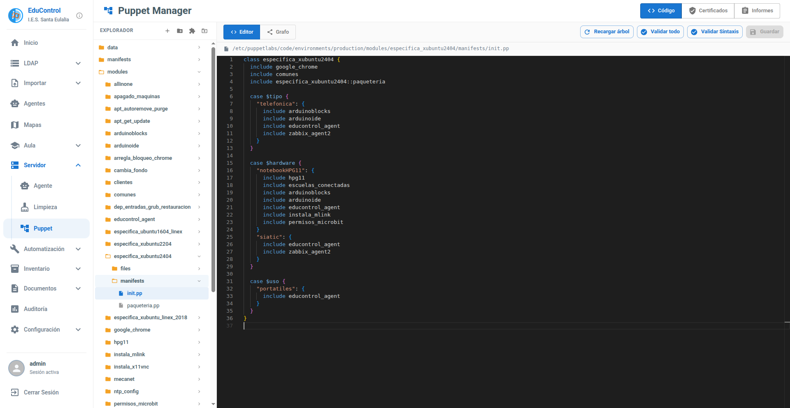
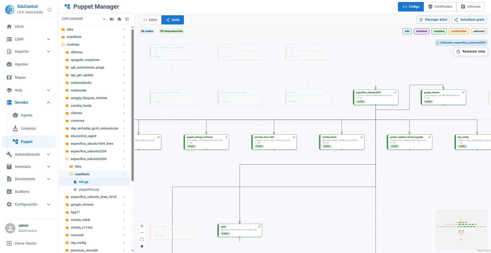
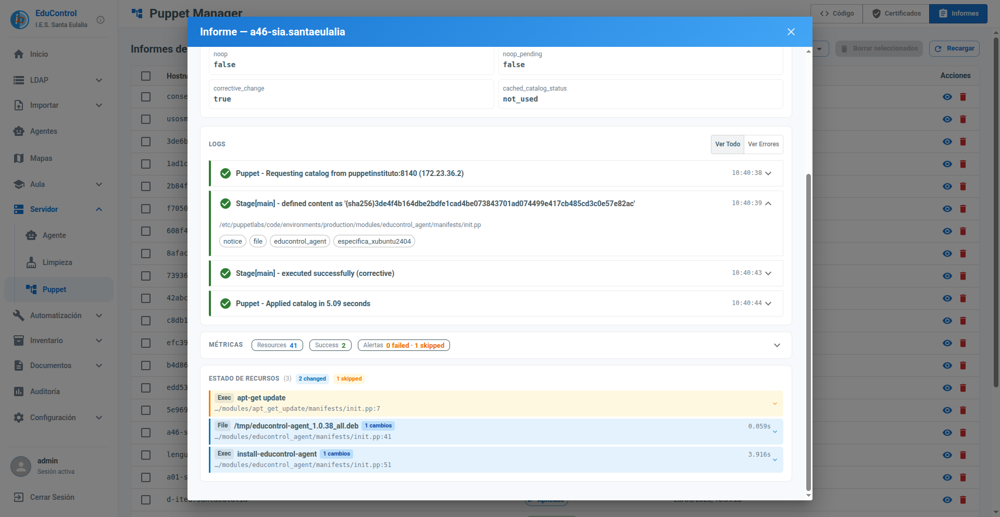

# Módulo del Servidor

Este módulo permite realizar el mantenimiento del servidor principal del centro educativo directamente desde la plataforma.

> **Importante:** Para que EduControl Server pueda realizar operaciones sobre el servidor, es necesario tener instalado previamente el agente en el propio servidor principal y, además, indicar cuál es el agente servidor en el menú "Servidor->Agente".

## Operaciones de Mantenimiento

Desde EduControl se llevarán a cabo diferentes operaciones de mantenimiento para asegurar el correcto funcionamiento del sistema, tales como:

- **Limpieza de Certificados Puppet:** Ante bloqueos del agente Puppet por certificados caducados o erróneos, el servidor EduControl gestiona su eliminación en el Servidor Principal a petición del agente afectado para su autoreparación. [+info](AGENTS.md#5-resoluci%C3%B3n-de-problemas-de-certificados-puppet)

- **Limpieza de Home Profesor:** Eliminación de los directorios personales de los profesores que ya no son usuarios del centro.

## Gestión de Puppet

EduControl incorpora un módulo específico de administración de Puppet desde la propia interfaz web para simplificar la gestión diaria del servidor de configuración.

### 1. Editor de tareas Puppet

Permite navegar por los módulos y editar manifiestos Puppet directamente desde el navegador, validando la sintaxis antes de guardar cambios.

[Vídeo demo del editor Puppet](./img/puppet_code.mp4)

### 2. Visualización del grafo de dependencias

Se puede consultar el grafo de relaciones entre tareas/módulos para entender qué clases incluyen a otras y detectar dependencias de forma visual.

### 3. Gestión de certificados de clientes

Incluye herramientas para revisar y gestionar certificados de nodos Puppet (por ejemplo, limpieza de certificados problemáticos), facilitando la recuperación ante bloqueos de agentes.

[Vídeo demo de gestión de certificados](./img/puppet_certs.mp4)

### 4. Informes de ejecución de clientes

Se muestran los reportes de ejecución de Puppet por cliente para analizar cambios aplicados, recursos modificados y errores detectados durante la ejecución.

[Vídeo demo de informes Puppet](./img/puppet_reports.webm)

[Volver](../README.md)
